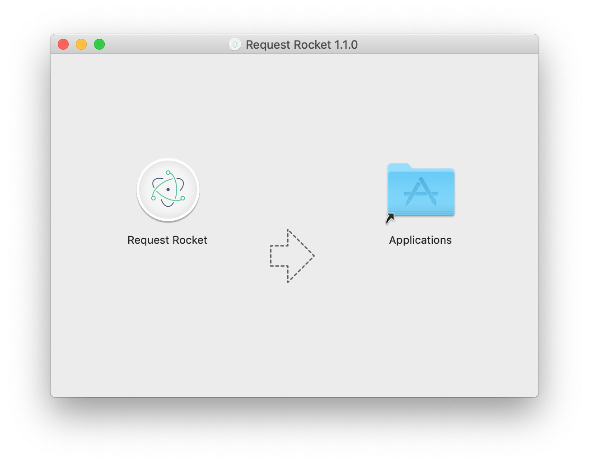
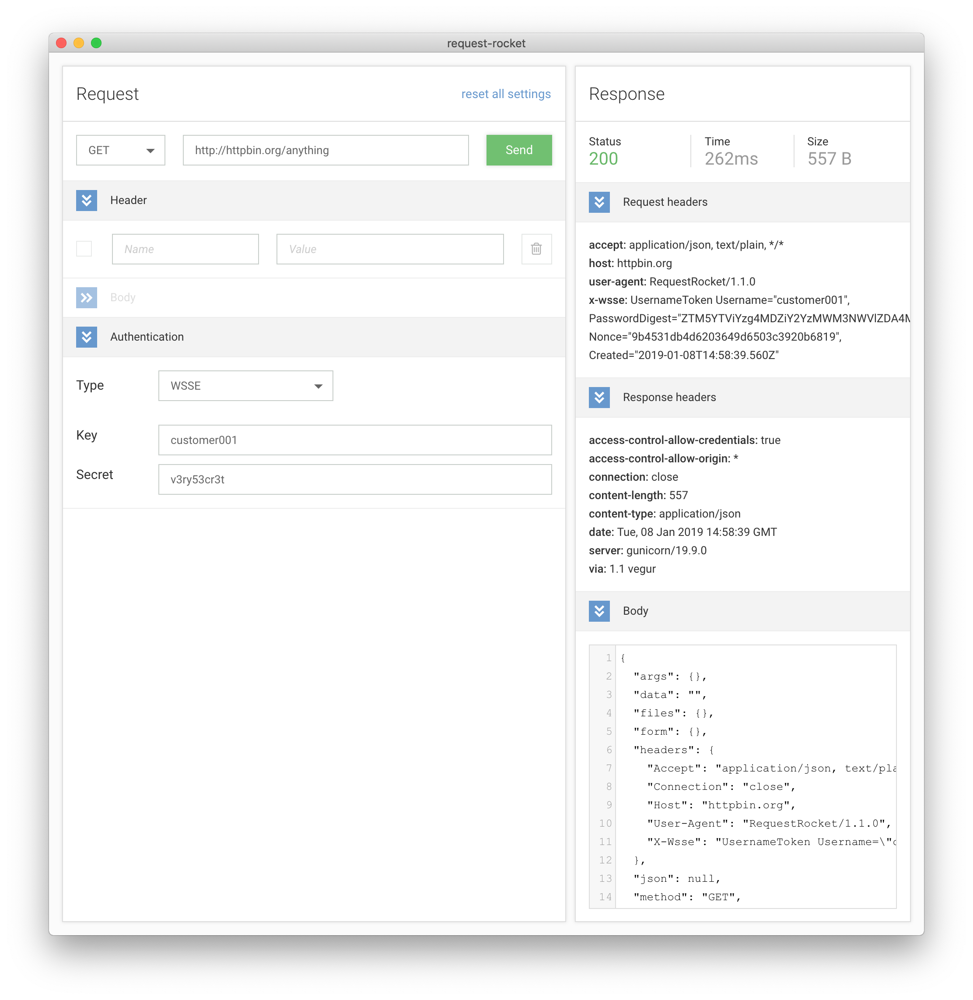
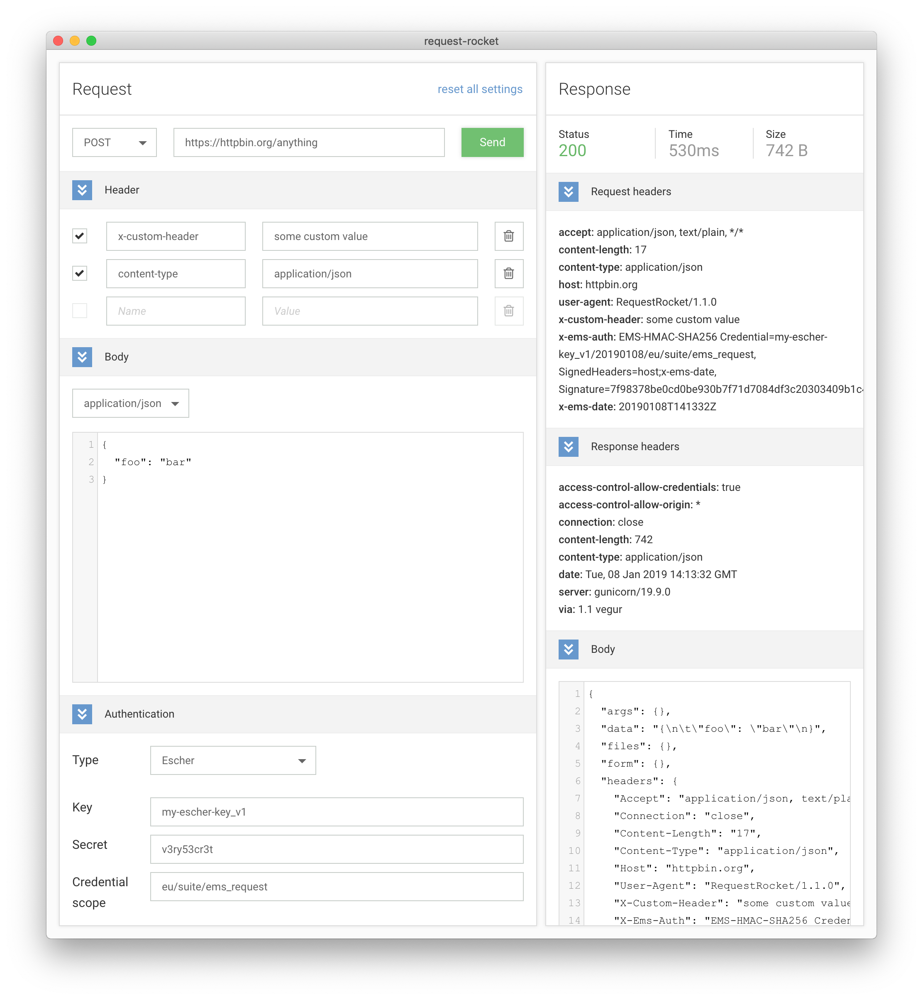

# Installation

Releases may be retrieved from the `Releases` page of the project's GitHub repository. [[Latest version]](http://github.com/emartech/request-rocket/releases/latest) 

To install the application (on macOS), just double-click the `.dmg` file and drag the "Request Rocket" app to "Applications."

# Authentication

Request Rocket provides built-in WSSE and Escher signature generator. You may select the desired authentication type from the `Authentication / Type` dropdown.

## WSSE

To use WSSE for authentication, please provide the API user name in the `Key` and the API secret in the `Secret` fields. In case you don't have an API user, please visit the `User management` page inside Emarsys.

## Escher signing

The Escher signer is configured to be used with Emarsys API thus the following constants are pre-configured and can not be changed.

Constant | Value
---------|------
vendor key | EMS
algo. prefix | EMS
hash algo. | SHA 256
auth. header | X-Ems-Auth
date header | X-Ems-Date  

